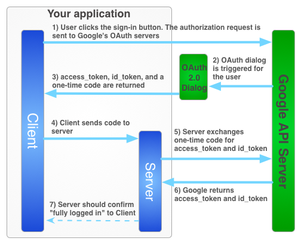

<!-- START doctoc generated TOC please keep comment here to allow auto update -->
<!-- DON'T EDIT THIS SECTION, INSTEAD RE-RUN doctoc TO UPDATE -->
**Table of Contents**

- [Concept](#concept)
  - [Project structure](#project-structure)
  - [Roadmap](#roadmap)
  - [Implementation](#implementation)
    - [Database Layer](#database-layer)
      - [Model](#model)
      - [Database Setup](#database-setup)
      - [Implement ORM](#implement-orm)
    - [View Layer](#view-layer)
    - [Service Layer](#service-layer)
      - [User Actions](#user-actions)
      - [Connect to View and Database](#connect-to-view-and-database)
        - [Connect Service to Database](#connect-service-to-database)
        - [Connect Service to View](#connect-service-to-view)
        - [Code-Examples](#code-examples)
  - [Message Flashing](#message-flashing)
    - [Code-Examples](#code-examples-1)
  - [JSON API Endpoints](#json-api-endpoints)
    - [Implement API Endpoints](#implement-api-endpoints)
  - [Authentication and Authorization](#authentication-and-authorization)
    - [Server-Side](#server-side)
    - [Client-Side](#client-side)
    - [Google-Specific Hybrid Flow](#google-specific-hybrid-flow)
      - [Implement Hybrid Flow](#implement-hybrid-flow)

<!-- END doctoc generated TOC please keep comment here to allow auto update -->

# Concept

## Project structure

- item_catalog/
    - doc/                - all documentation-related files
    - templates/          - all the template html files
    - static/             - static files like css/js/images
    - basic_server.py     - using a simple HTTP Basic Server
    - project.py          - using Flask Framework
    - database_setup.py      - creates our database by ORM
    - database_service.py    - uses crud-methods to operate on our db

## Roadmap

1. Database Layer
  * Create db-model
  * Create a [database_setup file](../database_setup.py) using sqlalchemy
  * Create a [database_service file](../database_setup.py) for crud operations
2. View Layer
  * Create html templates like [display_all.html](../templates/display_all.html) using jinja2 inheritance
    for each crud method.
  * Inside [project.py](../project.py) we implement the logic and routing
3. Service Layer
  * Create User Action model or table
  * Connect Database and View with our app [project.py](../project.py)
4. Use message flashing for handling error messages
5. Implement JSON Endpoints
6. Implement Authentication/Authorization

## Implementation

### Database Layer

#### Model
First we create our model


#### Database Setup
Now we create a database configuration file with our objects

Check [database_setup file](../database_setup.py) for code and documentation.

If we run this file with `python database_setup.py` then it creates our
**category_item.db** file, which contains our `CREATE` statements.

#### Implement ORM

Now we need a module to do CRUD operations on our db. For that we an ORM called
sqlalchemy. They allow us to call queries and commit them using objects.

Check [database_service file](../database_service.py) for code and documentation.

### View Layer

Flask uses the jinja2 template to render html files.

First we create a parent template [basic.html](../templates/basic.html) and
then several pages for our user actions.

Check the

  - templates/

directory to see all the templates.


### Service Layer

#### User Actions

*Example*

|URL         |METHOD     |POST/GET |ACTION                          |
|------------|-----------|---------|--------------------------------|
|'/','/items'|showAllData|GET      |display all items and categories|


**read as** *If the user goes to the url `/` or `/items` then call the method `showAllData()`*

Here you can see all necessary user actions:

|URL|METHOD           |POST/GET | ACTION |
|---|-----------------|---------|--------|
|'/','/items'|showAllData|GET|display all items and categories|
|'(string:category_name)/items'|showDataByCategory|GET|display items by category|
|'(string:category_name)/items/new'|createItem|GET/POST|display create item form or submit|
|'(string:category_name)/items/(int:item_id)'|showItem|GET|display display a single item|
|'(string:category_name)/items/(int:item_id)/edit'|editItem|GET/POST|display or edit item|
|'(string:category_name)/items/(int:item_id)/delete'|deleteItem|POST|display or edit item|

#### Connect to View and Database

##### Connect Service to Database

Because we already have setup our ORM we can just use the
[database_service file](../database_service.py) to call
the queries we need.

##### Connect Service to View

As a template engine flask uses jinja2. So to map data from our server to html files we can just use `render_template('file.html', *args)`

##### Code-Examples

* Implementing **showAllData** action

  ```
  @app.route('/')
  @app.route('/items')
  def showAllData():
      """Get all items and categories. Calculate the number of items.
      And pass data to html template
      """

      # get items and categories from database
      items = readAllItems()
      categories = readAllCategories()

      # calculate number of items
      num_items = len(items)

      # render template passing arguments
      return render_template("display_all.html", categories = categories, items = items, countItems = num_items)
  ```

  Above we can see that if the user calls the url `/` or `/items` then `showAllData()` will be executed.

  communication to **database**, see below

  ```
  # get items and categories from database
  items = readAllItems()
  categories = readAllCategories()
  ```

  communication to **view**, see below

  ```
  # render template passing arguments
  return render_template("display_all.html", categories = categories, items = items, countItems = num_items)
  ```

* Implementing **deleteItem** action

  ```
  @app.route('/<int:item_id>/delete', methods=['POST'])
  def removeItem(item_id):
      """Deletes an item from the database."""

      # delete item
      deleteItem(item_id)

      # redirect to showAllData
      return redirect(url_for('showAllData'))
  ```

  If the user triggers a post method with the url `/(int:item_id)/delete` then the item will be deleted.

## Message Flashing

The flashing system basically makes it possible to record a message at the end of a request and access it next request and only next request. This is usually combined with a layout template that does this.

### Code-Examples

First, in our `basic.html` we include following code to print out the flashed messages

```
<div class="content">
  
    <div class="alert alert-dismissible alert-{{category}}">
        <button type="button" class="close" data-dismiss="alert">&times;</button>
        {{message}}
    </div>
    
     
</div>
```

Next, we can include `flash()` in our application code to define what messages to print and when.
Here is one example:

```
def removeItem(category_name=None, item_id=None):
    """Deletes an item from the database."""

    # delete item
    deleteItem(item_id)
    flash("Item successfully deleted!", "success")

    ...
```
**read as** *after the item is deleted then flash the message "Item successfully deleted!"*

In our case we also use flashing with categories to better display the messages with an `danger` or `success` style.

Click [here](http://flask.pocoo.org/docs/0.12/patterns/flashing/#flashing-with-categories) to read more on flashing with categories.

## JSON API Endpoints

API (Application Programming Interface) allows external applications to use public information you want to share.

The best way to share the data is to use *json* format.
Let's assume that an external application wants to use our items and display them. So we have to provide them with an url like

http://localhost:5000/Land/items/JSON

and which returns an output looking like this

```
{
  "Items": [
    {
      "category_id": 3,
      "description": "Moving on trees",
      "id": 6,
      "title": "Ape"
    },
    {
      "category_id": 3,
      "description": "Living in dessert",
      "id": 7,
      "title": "Lion"
    }
  ]
}
```

And the external application can now use this data to show items on their site.

### Implement API Endpoints

The implementation is easy to follow.

1. Implement `serialize` method in [database_setup file](../database_setup.py) to specify the data we want to share and to make it easy for flask to use.

  Here is the implementation for the category entity:

  ```
  ...
  @property
  def serialize(self):
      return {
          'name': self.name,
          'id': self.id
      }
  ...
  ```

2. Import and use `jsonify` to configure an API endpoint

  Eg. to get all categories as json we can just implement a new route which returns all the categories as json

  ```
  @app.route('/categories/JSON')
  def getAllCategoriesJSON():
      """Returns all categories as json."""

      categories = readAllCategories()
      return jsonify(Categories=[i.serialize for i in categories])
  ```

3. If we call the url http://localhost:5000/categories/JSON then we will get following output:

  ```
  {
    "Categories": [
      {
        "id": 1,
        "name": "Water"
      },
      {
        "id": 2,
        "name": "Air"
      },
      {
        "id": 3,
        "name": "Land"
      }
    ]
  }
  ```

There are also other methods to implement an API.
More info [here](http://flask-restless.readthedocs.io/en/latest/basicusage.html).

## Authentication and Authorization

Authentication is the process of ascertaining that somebody really is who he claims to be. For example when you check login credentials to see if you recognize a user as logged in

Authorization refers to rules that determine who is allowed to do what. E.g. Adam may be authorized to create and delete databases, while Usama is only authorised to read.

### Server-Side

Allows a server to obtain an access token. To allow the server to make api-requests on behalf of the user. But the user has an option to set an timeout or revoke access to the tokens at any time.

**Advantage**: More power to server-side applications.

**Disadvantage**: Server is responsible to enable session-tracking and secure storage of access tokens

### Client-Side

All the code to authenticate a user is initiated throught javascript from the users browser. Useful for single-page browser-based webapplications.

**Advantage**: Quick, Easy

**Disadvantage**: Server cannot make API calls to the OAuth-Provider

### Google-Specific Hybrid Flow

Here is a diagram showing the hybrid authorization flow that we want to implement:



**Advantage**: This flow allows authentication on client-side and allows the server to do API-Calls on behalf of the client. And with one-time-codes google provides tokens directly to server without intermediaries.

#### Implement Hybrid Flow

The implementation of the hybrid (one-time-code flow) follows this guide:
https://developers.google.com/identity/sign-in/web/server-side-flow

1. Create Client ID and Client Secret with Google to communicate with its API Libraries.

2. Generate unique session tokens

3. Create Login Page
