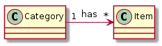

**Table of Contents**

- [Concept](#concept)
  - [Project structure](#project-structure)
  - [Roadmap](#roadmap)
  - [Implementation](#implementation)
    - [Database Layer](#database-layer)
      - [Model](#model)
      - [Database Setup](#database-setup)
      - [Implement ORM](#implement-orm)
    - [View Layer](#view-layer)
    - [Service Layer](#service-layer)
      - [User Actions](#user-actions)
      - [Connect to View and Database](#connect-to-view-and-database)
        - [Connect Service to Database](#connect-service-to-database)
        - [Connect Service to View](#connect-service-to-view)
        - [Code-Examples](#code-examples)

# Concept

## Project structure

- item_catalog/
    - doc/                - all documentation-related files
    - basic_server.py     - using a simple HTTP Basic Server
    - project.py          - using Flask Framework
    - database_setup.py      - creates our database by ORM
    - database_service.py    - uses crud-methods to operate on our db

## Roadmap

1. Database Layer
  * Create db-model
  * Create a [database_setup file](../database_setup.py) using sqlalchemy
  * Create a [database_service file](../database_setup.py) for crud operations
  * Connect database with project.py(sever) using [database_service.py](../database_service.py)

3. View Layer
  * Create html templates like [display_all.html](../templates/display_all.html) using jinja2 inheritance
    for each crud method.
  * Inside [project.py](../project.py) we implement the logic and routing

4. Service Layer
  * Create User Action model or table
  * Connect Database and View with our app [project.py](../project.py)

5. Use message flashing for handling error messages

6. Implement JSON Endpoints

## Implementation

### Database Layer

#### Model
First we create our model



#### Database Setup
Now we create a database configuration file with our objects

Check [database_setup file](../database_setup.py) for code and documentation.

If we run this file with `python database_setup.py` then it creates our
**category_item.db** file, which contains our `CREATE` statements.
7
#### Implement ORM

Now we need a module to do CRUD operations on our db. For that we an ORM called
sqlalchemy. They allow us to call queries and commit them using objects.

Check [database_service file](../database_service.py) for code and documentation.

### View Layer

Flask uses the jinja2 template to render html files.

First we create a parent template [basic.html](../templates/basic.html) and
then several pages for our user actions.

Check the

  - templates/

directory to see all the templates.


### Service Layer

#### User Actions

*Example*

|URL|METHOD           |POST/GET | ACTION |
|---|-----------------|---------|--------|
|'/','/items'|showAllData|GET|display all items and categories|

**read as** *If the user goes to the url '/' or '/items' then call the method `showAllData()`*

Here you can see all necessary user actions:

|URL|METHOD           |POST/GET | ACTION |
|---|-----------------|---------|--------|
|'/','/items'|showAllData|GET|display all items and categories|
|'(string:category_name)/items'|showDataByCategory|GET|display items by category|
|'(string:category_name)/items/new'|createItem|GET/POST|display create item form or submit|
|'(string:category_name)/items/(int:item_id)'|showItem|GET|display item|
|'(string:category_name)/items/(int:item_id)/edit'|editItem|GET/POST|display or edit item|
|'(string:category_name)/items/(int:item_id)/delete'|deleteItem|POST|display or edit item|

#### Connect to View and Database

##### Connect Service to Database

Because we already have setup our ORM we can just use the
[database_service file](../database_service.py) to call
the queries we need.

##### Connect Service to View

As a template engine flask uses jinja2. So to map data from our server to html files we can just use `render_template('file.html', *args)`

##### Code-Examples

  1. Implementing **showAllData** action

  ```
  @app.route('/')
  @app.route('/items')
  def showAllData():
      """Get all items and categories. Calculate the number of items.
      And pass data to html template
      """

      # get items and categories from database
      items = readAllItems()
      categories = readAllCategories()

      # calculate number of items
      num_items = len(items)

      # render template passing arguments
      return render_template("display_all.html", categories = categories, items = items, countItems = num_items)
  ```

  Above we can see that if the user calls the url */* or */items* then `showAllData()` will be executed.

  communication to **database**, see below

  ```
  # get items and categories from database
  items = readAllItems()
  categories = readAllCategories()
  ```

  communication to **view**, see below

  ```
  # render template passing arguments
  return render_template("display_all.html", categories = categories, items = items, countItems = num_items)
  ```

  2. Implementing **deleteItem** action

## Message Flashing

## JSON API Endpoints
